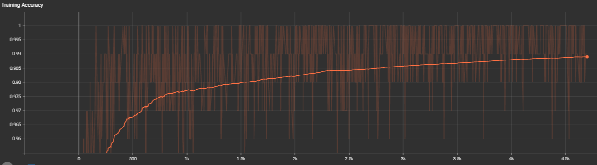
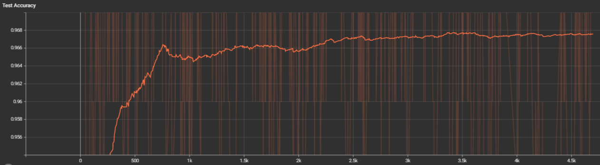

# About The Project
An implementation of Capsule Network proposed in "[Dynamic Routing Between Capsules](https://arxiv.org/abs/1710.09829)" by Sara Sabour, Nicholas Frosst, Geoffrey E Hinton. I used MNIST
dataset as in the paper. 

# Requirements
torch, torchvision, tqdm

# Usage
Layers are implemented in **layers.py** and they are for general use. Networks (Capsule Network and the Reconstruction Network) are implemented in **networks.py** and they are specific to the dataset, and should be changed for different datasets. **networks.py** imports from **layers.py**.

**main.py** gives the output for the TensorBoard, and also saves the weights. Put any hyperparameters you want to use in the hyperparameter dictionary  as a list (for hyperparameter search), and use them accordingly in the _'execute'_ function. main.py imports from **networks.py**.

# Results
Results can be found in the tensorboard file in tensorboard directory. Here is a quick look for:

The model was trained for 100 epochs for the batch size of 128. This result is obtained by checking in every 10 update with 100 random samples from the train and test data. 

I am planning to update this so that I check with a bigger batch whenever the results from 100 samples gives high enough accuracy. For example, when I get 99% test accuracy and 100% train accuracy with a batch size of 100, I will randomly choose another 900 samples to calculate the overall accuracy for 1000 samples. Because right now, the maximum train and test accuracies are 100%, although the model seems to converge around 97%.

It took about 3 hours to train the model on GeForce GTX 1650 Ti 4GB, Intel(R), Core(TM) i5-10300H CPU @ 2.50Ghz.

# Contact
kaan.buyukdemirci@ug.bilkent.edu.tr, kaanbuyukdemirci2023@gmail.com

# License
