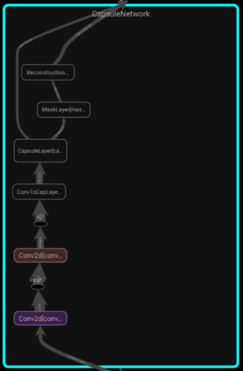
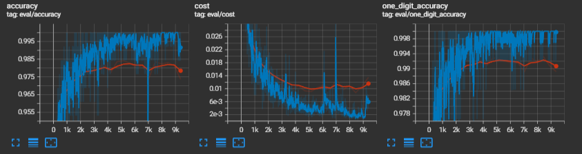

# About The Project
An implementation of Capsule Network proposed in "[Dynamic Routing Between Capsules](https://arxiv.org/abs/1710.09829)" by Sara Sabour, Nicholas Frosst, Geoffrey E Hinton. I used MNIST
dataset as in the paper. 

# Requirements
torch, torchvision, tqdm

If you use PyTorch 2, and have a supported system, you can uncomment line 50 in main.py to increase speed. 

# Usage
Layers are implemented in **layers.py** and they are for general use. Networks (Capsule Network and the Reconstruction Network) are implemented in **networks.py** and they are specific to the data set, and should be changed for different data sets. **networks.py** imports from **layers.py**.

**main.py** gives the output for the TensorBoard, and also saves the best weights. **profile.py** profiles the model and the script and saves the profile in **tensorboard/profiler**. It also extracts the graph and saves it in there as well. I couldn't open the profile for some reason. But here is a quick look at the graph:

# Results
Results can be found in the tensorboard file in tensorboard directory. And saved weights can be found in checkpoints directory. Here is a quick look:

The model was trained for 20 epochs with the batch size of 128. Results for validation (test) was obtained on the whole validation (test) set at every epoch. The results for train was obtained by checking every train batch individually.

Accuracy is measured assuming we don't know if and how many digits there are in the given picture. So it applies a threshold of 0.5 to the norm of every digit capsule, and makes a prediction. For a prediction to be true, it should exactly match to the label, meaning we can't predict more or less digits, and we must predict the right digit. Highest accuracy achieved on the whole validation (test) set is 98.41%.

One digit accuracy is more forgiving. Now, we assume that we know there is only one digit in any given picture. So now, we make our predictions by choosing the capsule with maximum norm. As a result, this accuracy is always greater than or equal to the usual accuracy. Highest one digit accuracy achieved on the whole validation (test) set is 99.32%.

Both of these results were obtained by assuming:
* We don't include the iteration process into the computational graph (if you want to include it to the computation graph, comment line 97 and uncomment line 98 in layers.py)
* There is no bias (if you want to include bias, uncomment lines 51-53, 107, 124 in layers.py)
* There is a ReLu layer at the end of second convolution. (if you don't want it, comment line 62 in networks.py)
* There is weight sharing as mentioned in the paper (if you don't want it, comment line 45 and uncomment line 46 in networks.py)

I tested these assumptions, but the result doesn't seem to change much. I also used 3 iterations.

It took about 40 minutes to train the model on GeForce GTX 1650 Ti 4GB, Intel(R), Core(TM) i5-10300H CPU @ 2.50Ghz. So each epoch takes about 2 minutes.

# Contact
kaan.buyukdemirci@ug.bilkent.edu.tr, kaanbuyukdemirci2023@gmail.com

# License
